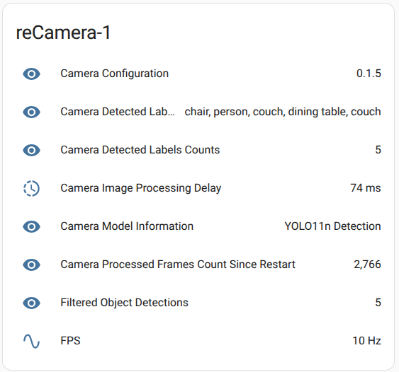
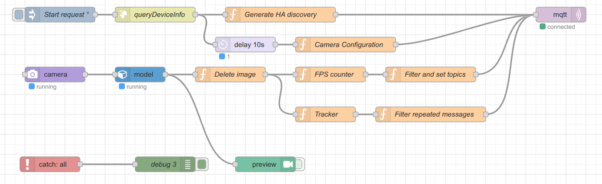
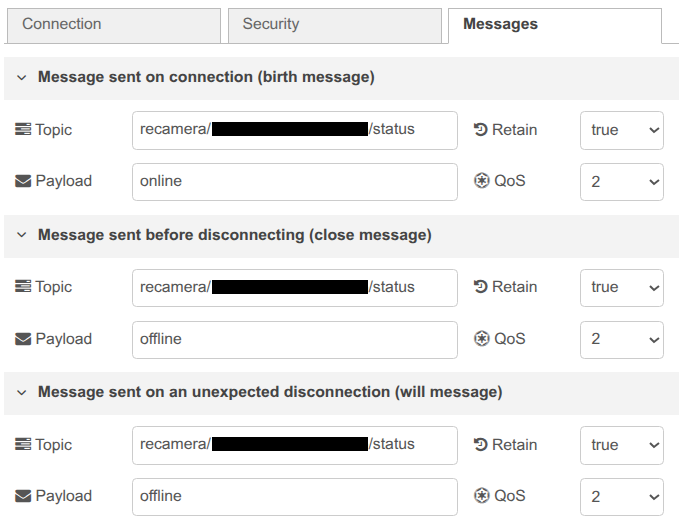
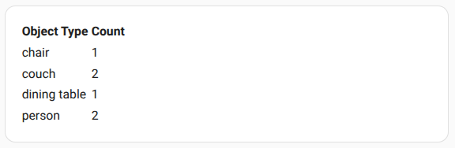
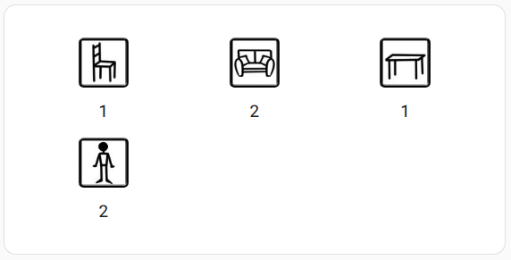
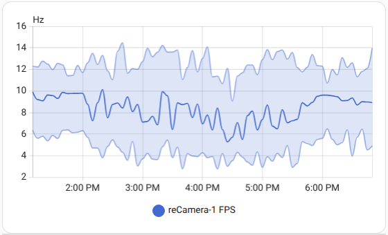
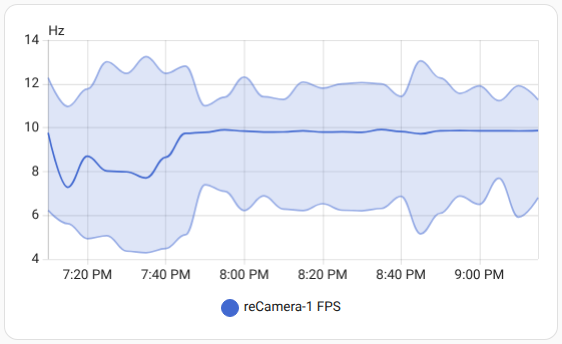

# reCamera HomeAssistant Integration

A privacy-first Node-RED flow that transforms the [reCamera SG200X](https://github.com/Seeed-Studio/OSHW-reCamera-Series) into an intelligent sensor for HomeAssistant, providing real-time object detection and room monitoring **without transmitting any images**. This integration allows for automation based on detected objects using AI models as YOLOv11n.

This integration uses the Node-RED development environment in the reCamera device and its available [SSCMA nodes](https://github.com/Seeed-Studio/node-red-contrib-nodes/tree/main/node-red-contrib-sscma).


## Privacy-First Approach

This integration prioritizes privacy by:
- **Zero image transmission** - Only object detection metadata is sent
- **Local AI processing** - All computer vision runs on the reCamera device
- **Configurable data retention** - Control what information is stored and shared

## Features

- **MQTT-based HomeAssistant device discovery** to automatically create the sensors in HomeAssistant
    * MQTT availability topic configured for all the entities. HomeAssistant will automatically notice that the entities/sensors are not available when the reCamera device is offline.
- **Comprehensive sensor suite**
    * Detected objects information, including their count, confidence, bounding box, etc. to enable automation based on detected objects.
    * FPS, processing delays, model information, etc. to monitor the performance of the reCamera device
- **Simple object detection filtering** to reduce false positives and improve the accuracy of the object detection.
- **Dashboard templates** for HomeAssistant to display the object detection results
- **Multiple reCamera devices** support.


### Object Tracking

The flow includes a simplified tracking system that:

- **Reduces false positives** by requiring consistent detections
- **Smooths object counts** to prevent rapid fluctuations
- **Enables the use of stable automation triggers** for HomeAssistant
- **Minimizes message traffic** by only sending changes in the object count of each label

This tracking system is designed to be lightweight and fast, minimizing the memory and CPU usage in the reCamera device. The algorithm operates on three core principles:

- **Object Association**: New detections are matched to existing tracked objects based on object class and spatial proximity. Objects are associated when they share the same class (e.g., "person", "chair") and their center points are within a configurable pixel distance threshold.

- **Confidence-Based Activation**: Objects become "active" (counted) only after meeting strict criteria: consistent detection over multiple consecutive frames combined with confidence scores above a threshold. This prevents false positives from temporary noise or shadows.

- **Temporal Persistence**: Once activated, objects remain counted for a minimum time period even when temporarily undetected, handling brief occlusions or detection gaps.

The algorithm maintains object state across frames using unique tracking IDs, enabling smooth count transitions and stable automation triggers.

The `simple-tracker-tests` subfolder contains some tests to evaluate the performance of the tracking system with captures from the reCamera device. More information about the tracking system can be found in the [simple-tracker-tests/README.md](./simple-tracker-tests/README.md) file.


## HomeAssistant Sensors

The integration automatically creates the following sensors in HomeAssistant:




### Camera Configuration

   - Received from MQTT Topic: `recamera/{serial_number}/camera_config`
   - Shows the firmware version of the reCamera device
   - Configuration details available as attributes: 

<details>
<summary>Attributes example</summary>

```json
{
  "code": 0,
  "data": {
    "appName": "supervisor",
    "channel": 0,
    "cpu": "sg2002",
    "deviceName": "reCamera-1",
    "dns": "-",
    "gateway": "192.168.1.1",
    "ip": "127.0.0.1",
    "mask": "255.255.255.0",
    "needRestart": 0,
    "npu": 1,
    "officialUrl": "https://github.com/Seeed-Studio/reCamera-OS/releases/latest",
    "osName": "reCamera",
    "osUpdateTime": "2024.01.01",
    "osVersion": "0.1.5",
    "ram": 256,
    "serverUrl": "",
    "sn": "123456789012345678",
    "terminalPort": 9090,
    "wifiIp": "192.168.1.137"
  },
  "msg": ""
}
```

</details>

### Camera Detected Labels

   - Received from MQTT Topic: `recamera/{serial_number}/detection`
   - Lists currently detected object types
   - Includes full detection JSON as attributes:

<details>
<summary>Attributes example</summary>

```json
{
   "code":0,
   "data":{
      "boxes":[
         [ 97, 359, 157, 220, 72, 56 ], ...
      ],
      "count":12342,
      "labels":[ "chair", "person", "couch", "dining table", "book" ],
      "perf":[ [0,46,32] ],
      "resolution":[ 640, 640 ]
   },
   "name":"invoke",
   "type":1
}
```
</details>

### Camera Detected Labels Counts

   - Received from MQTT Topic: `recamera/{serial_number}/detection`
   - Total number of objects currently detected.
   - Obtained with the following template: `{{ value_json.data.labels | length }}`
   - The attributes provide the count of each label using the following Jinja2 template.

<details>
<summary>Template:</summary>

```jinja
   
   
      
   
   {{ {'label_counts': ns.counts} | tojson }}
```
</details>

### Camera Image Processing Delay

   - Received from MQTT Topic: `recamera/{serial_number}/detection`
   - Reports AI inference latency
   - Obtained as the sum of the "perf" field: `{{ value_json.data.perf[0][0] + value_json.data.perf[0][1] + value_json.data.perf[0][2]  }}`

### Camera AI Model Information

   - Received from MQTT Topic: `recamera/{serial_number}/model_info`
   - Active AI model name
   - Model details are available as attributes: 

<details>
<summary>Attributes example</summary>

```json
{
  "code": 0,
  "data": {
    "ai_framwork": "6",
    "author": "Ultralytics",
    "checksum": "7819bd8d3958f5184fb20cd8b0490525",
    "classes": [ "person", "bicycle", ..., "toothbrush" ],
    "description": "YOLO11n official model from Ultralytics.",
    "model_format": "cvimodel",
    "model_id": "10001",
    "model_name": "YOLO11n Detection",
    "pic_url": "https://github.com/ultralytics/docs/releases/download/0/object-detection-examples.avif",
    "version": "1.0.0"
  },
  "name": "create",
  "type": 0
}
```
</details>

### Camera Processed Frames Count Since Restart

   - Received from MQTT Topic: `recamera/{serial_number}/detection`
   - Tracks total frames processed since device restart.
   - State class: `total_increasing`
   - Obtained with the following template: `{{ value_json.data.count | int }}`


### Filtered Object Detections

   - Received from MQTT Topic: `recamera/{serial_number}/filtered_detections`
   - Tracked object counts with temporal filtering
   - Reduces false positives and noise. More stable count for automation logic.
   - Processing is performed in the Node-RED flow.
   - Attributes provide the count of each label:

<details>
<summary>Attributes example</summary>

```json
{
   "timestamp":1752862398347,
   "num_objects":5,
   "class_counts":{
      "chair":1,
      "couch":1,
      "person":1,
      "dining table":1
   },
   "active_objects":[
      {
         "classLabel":"chair",
         "meanConfidence":70.62740127763269,
         "lastPosition":[ 175.5, 481.5 ],
         "missedDetections":0
      }, ...
   ]
}
```
</details>

### Camera FPS

   - Received from MQTT Topic: `recamera/{serial_number}/fps`
   - Frames per second measurement performed every 10 seconds in the Node-RED flow.


## Node-RED Flow



The flow is divided into two main branches that converge into the MQTT client block:

1. **HomeAssistant MQTT Discovery**
   - This part of the flow is responsible for sending the discovery messages to HomeAssistant.
   - This branch is triggered only once when the flow is deployed by the `Start request` node.
   - The first operation performed is to obtain the device serial number, as it is needed to create unique MQTT topics and entities.
   - The Camera Configuration message is also sent in this branch, after 10 seconds to ensure HomeAssistant has properly configured the entity.
   - The MQTT discovery and the camera configuration messages are sent with the `retain` flag activated and QoS level 1. This way, HomeAssistant will receive the messages when it connects to the broker after a restart.

2. **Image Capture and Processing**
   - This branch is responsible for capturing the image from the reCamera device, detecting objects in it using the YOLOv11n model, and processing the results to send them to HomeAssistant.
   - The first operation after IA model processing is to delete the image from the message. After this operation, processing is divided into two new branches:
      * The first branch is responsible for sending all the detected objects and the FPS.
         - The `FPS counter` block calculates the FPS and injects messages into the `fps` topic every 10 seconds.
         - The `Filter and set topics` block sets the correct topic of each message and discards unwanted messages.
      * The second branch performs object tracking and message filtering to minimize the number of messages sent to HomeAssistant.
         - The `Tracker` block implements a simple object tracking algorithm.
         - The `Filter repeated messages` block only sends messages if the object count of each kind has changed.

3. **MQTT Client**
   - This final block is responsible for sending the messages to the MQTT broker.
   - This block receives messages with different topic destinations and configurations, so it should be configured with the `topic`, `qos` and `retain` fields left blank.
   - The `mqtt-broker` configuration used by this node should be configured with the appropriate MQTT server configuration: IP, port, username, password, etc.
   - Also, this block should be configured by hand to match the `availability_topic` of the configured entities. The broker birth, close, and will messages should be set to the `recamera/{serial_number}/status` topic, with `online` payload for birth and `offline` payload for close and will.


### Topics Structure and Discovery

The topic structure of the general messages is as follows:

```
recamera/{serial_number}/{msg_type}
```

Where:
- `{serial_number}` is the serial number of the reCamera device.
- `{msg_type}` is the type of the message. The msg_types are:
   - `camera_config`: Configuration details of the reCamera device.
   - `detection`: Raw object detections with bounding boxes and confidence scores.
   - `model_info`: Information about the AI model used by the reCamera device.
   - `fps`: Frames per second measurement.
   - `filtered_detections`: Tracked and filtered objects with confidence scores and last position.
   - `status`: Status of the reCamera device (online/offline). Sent by the MQTT client block on connection and disconnection.


The topics used to configure HomeAssistant automatic discovery topics have the following structure:

```
homeassistant/sensor/{serial_number}_{entity_name}/config
```

Where:
- `{serial_number}` is the serial number of the reCamera device.
- `{entity_name}` is the name of the entity, such as `detected_labels`, `filtered_objects`, `fps`, `model_info`, etc.


## Installation and Setup

### Requirements

- **reCamera SG200X** with reCamera OS and Node-RED services enabled.
- **HomeAssistant** server with MQTT integration enabled
- **MQTT Broker** such as Mosquitto or HomeAssistant Add-on.

The MQTT broker should be accessible from both devices.

### 1. MQTT Broker Setup

#### Option A: HomeAssistant Add-on

In HomeAssistant, install the Mosquitto MQTT addon: `Configuration -> Add-ons -> Add-on Store -> Mosquitto broker -> Install`.

Configure the MQTT broker: `Configuration -> Add-ons -> Mosquitto broker -> Settings -> Configuration`.

#### Option B: External MQTT Broker

Example of how to install Mosquitto on a separate Debian/Ubuntu server:

```bash
# Install Mosquitto on separate server
sudo apt update
sudo apt install mosquitto mosquitto-clients

# Configure basic settings
sudo nano /etc/mosquitto/mosquitto.conf
```

### 2. HomeAssistant MQTT Integration

1. Go to **Settings** → **Devices & Services**
2. Click **Add Integration** and search for **MQTT**
3. Configure broker connection:
   ```
   Broker: localhost (if using addon) or broker IP
   Port: 1883 (or 8883 for TLS)
   Username: [your-mqtt-username]
   Password: [your-mqtt-password]
   ```
4. Ensure that the automatic discovery is enabled in the MQTT options settings and the discovery prefix is set to `homeassistant`. If the prefix is set to other value, you will need to modify the code of the `Generate HA discovery` node.


### 3. reCamera Node-RED Configuration

1. **Access Node-RED**: Open `http://{recamera_ip}/#/workspace` in your browser
2. **Import Flow**: Copy the contents of `flows.json` and import into Node-RED
3. **Configure MQTT Node and MQTT Birth/Will Messages**:
   - Double-click the MQTT output node
   - Set server to your MQTT broker IP
   - Configure authentication if required
   - Configure the MQTT client birth and will messages to ensure HomeAssistant knows when the device is online/offline.
      - **Birth Topic**: `recamera/{serial_number}/status`
      - **Birth Payload**: `online`
      - **Close Topic**: `recamera/{serial_number}/status`
      - **Close Payload**: `offline`  
      - **Will Topic**: `recamera/{serial_number}/status`
      - **Will Payload**: `offline`



5. **Deploy**: Click the deploy button to load and start the flow

You now should be able to see the reCamera device in HomeAssistant, in the `Devices & Services` section. Now you can start configuring the dashboard.


#### Optional configuration of nodes

The Node-RED flow can be configured to specific needs or to improve the performance and reduce the number of messages sent to HomeAssistant.

The `Generate HA discovery` node should be configured to match the discovery prefix configured in the MQTT options settings. The default value is `homeassistant`.

The `Filter and set topics` node can be configured to disable unnecessary or unwanted messages. For example, the `detection` topic can be disabled to avoid sending too many messages to HomeAssistant, as the `filtered_detections` topic already contains similar information.

The `Tracker` node can be configured to match the specific needs of the user:
   - `ACTIVATION_THRESHOLD`: Objects are considered present when the activation metric is above this threshold. The default value is 40.
   - `DEACTIVATION_THRESHOLD`: Objects are considered not present when the deactivation metric is below this threshold. The default value is 15.
   - `MIN_DEACTIVATION_TIME`: Minimum time in milliseconds that the objects will live even when they are not detected. The default value is 2000.
   - `MAX_DEACTIVATION_TIME`: Maximum time in milliseconds that the objects will live when they are not detected. The default value is 5000. This value should be greater than `MIN_DEACTIVATION_TIME`.
   - `MAX_DISTANCE`: Max pixel distance for association. The default value is 100.


## Dashboard

Here are some example cards that can be used to display the object detection results in HomeAssistant.

### Object Counts

#### Object Count Tables




You can use the following template to display the object count of each label. You can also use the `class_counts` attribute of the `filtered_object_detections` sensor to display the filtered counts.

```yaml
type: markdown
content: |-
  |Object Type| Count |
  |:----------| ----- | 
  | {{ label }} | {{ count | int }} |
  
```


### Visual Object Counts



You can use the following template to display the filtered object count of each label as icons. You can also use the `label_counts` attribute of the `camera_detected_labels_counts` sensor to display the unfiltered counts.

```yaml
type: custom:html-template-card
ignore_line_breaks: true
content: |
  <div style="display: grid; grid-template-columns: repeat(auto-fill,
  minmax(100px, 1fr)); gap: 16px; padding: 16px;">
    
      <div style="text-align: center;">
        
        <div style="margin-top: 8px; font-size: 1.2em;">{{ count }}</div>
      </div>
    
  </div>
```

This template uses the COCO icons from the `coco_icons` folder in this repository. To use them, you need to:

1. Create `/homeassistant/www/coco_icons/` directory in HomeAssistant
2. Copy the COCO icons from the `coco_icons` folder in this repository to the `coco_icons` directory in HomeAssistant.
   - The icons were downloaded from the [COCO dataset website](https://cocodataset.org/) and are licensed under the [Creative Commons Attribution 4.0 International License](https://creativecommons.org/licenses/by/4.0/legalcode).


## Performance Tuning

The performance of the reCamera device is very limited. Node-RED usually eats too many memory and CPU resources for an embedded device like the reCamera. However, there are some things that can be done to improve the performance:

- Once the flow is deployed and started, restart the reCamera device without opening the Node-RED interface in the browser. The flow should start automatically and will consume less resources.
- Remove the SSCMA preview node and other debug nodes from the Node-RED flow.
- If not used, some nodes can be removed from the flow:
   - `Tracker` and `Filter repeated messages` nodes can be removed if the user is only interested in the raw object detections.
   - `FPS counter` node can be removed if not interested in measuring the performance of the reCamera device.

The following figure shows an example of the FPS obtained during development with the Node-RED web interface open. The performance is very unstable and does not achieve 10 FPS in average.



The following figure shows an example of the FPS obtained after closing the Node-RED web interface and restarting the reCamera device. In this case, the performance is much more stable and achieves 10 FPS in average.




## License

This HomeAssistant integration is licensed under the MIT License - see the main project [LICENSE](../LICENSE) file for details.

## Related Resources

- [Node-RED Documentation](https://nodered.org/docs/)
- [HomeAssistant MQTT Discovery](https://www.home-assistant.io/docs/mqtt/discovery/)
- [reCamera Documentation](https://wiki.seeedstudio.com/reCamera_intro/)
- [MQTT Broker Setup Guide](https://www.home-assistant.io/docs/mqtt/broker/)

