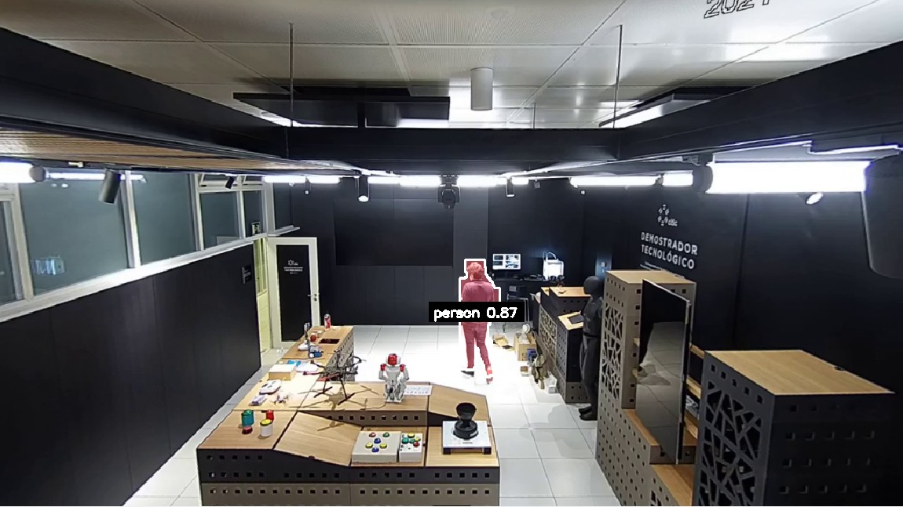
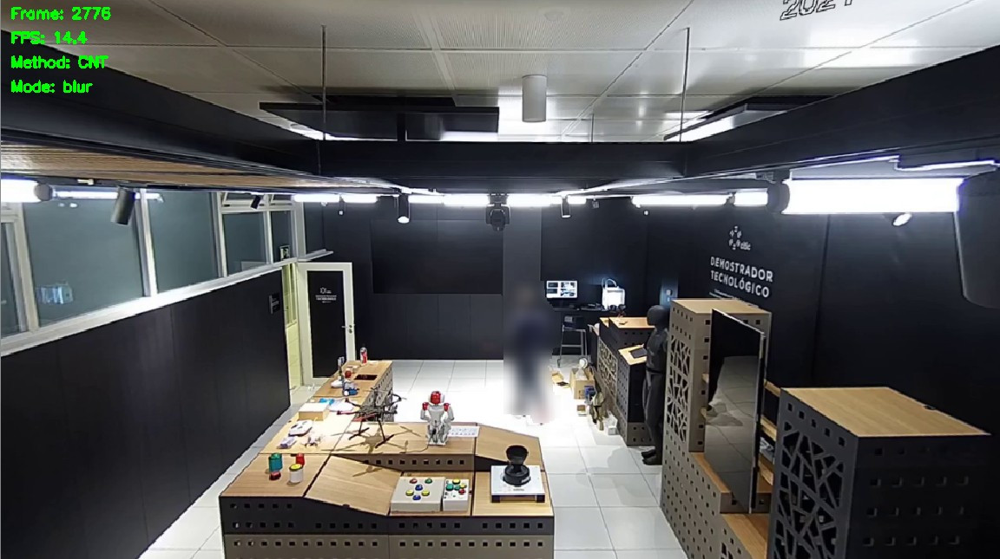

# Video Anonymizer

A real-time video anonymization system designed for privacy-preserving video monitoring. The system detects and anonymizes people in video streams while preserving visual content for security, home automation or other monitoring purposes. The main idea is to allow the use of more powerful AI models for processing the video stream while keeping the visual content private. This way, the user can use the full power of AI models whether they are deployed on-premise or in the cloud minimizing concerns about privacy.

Built specifically for the reCamera SG200X platform with additional implementations for development and desktop use.

## Features

- **Real-time human detection** using YOLOv11 segmentation models
- **Multi-platform support**: Python, C++, reCamera
- **Multiple anonymization modes**: blur, background replacement, solid fill (C++ implementations use background replacement)
- **Background modeling** using different OpenCV algorithms (Python only). C++ implementation uses a simplified method.
- **Visual object tracking** to handle missed detections (Python only)
- **RTSP streaming** for reCamera devices
- **GPU acceleration** support in Python and C++ implementations

## Project Structure

This repository contains three distinct implementations:

### Python Implementation
**Location**: `python/`
**Best for**: Development, testing, and desktop applications

- Easy to use and modify
- Interactive preview and debugging
- Several configuration options and modes
- OpenCV for video processing
- GPU acceleration support (CUDA)

### C++ Implementation  
**Location**: `cpp/default_project/`
**Best for**: High-performance applications on standard platforms

- Cross-platform C++ implementation
- ONNX Runtime for model inference
- OpenCV for video processing
- GPU acceleration support (CUDA)

### reCamera Embedded Implementation
**Location**: `cpp/recamera_project/`
**Best for**: Edge deployment on reCamera devices

- Optimized for Sophgo SG200X ReCamera
- RISC-V architecture support
- OpenCV for video processing
- H.264 RTSP streaming
- TPU acceleration for AI inference
- Low power consumption optimized for edge deployment
- **Limitations**: Only supports a simplified background replacement anonymization mode due to computational constraints

## Quick Start

### Python Implementation

```bash
cd python
pip install -r requirements.txt
python main.py
```

### C++ and reCamera Implementation

Follow the instructions in the `cpp/README.md` file to build the projects.

## Dependencies

### Python Implementation
- [Ultralytics](https://github.com/ultralytics/ultralytics)
- [OpenCV](https://opencv.org/)

### C++ Implementation
- [YOLOs-CPP](https://github.com/Geekgineer/YOLOs-CPP): C++ implementation of YOLO models for object detection.
- [ONNX Runtime](https://onnxruntime.ai/)
- [OpenCV](https://opencv.org/)
- [CMake](https://cmake.org/)
- C++17 compatible compiler

### reCamera Implementation
- [Sophgo SG200X SDK](https://github.com/Seeed-Studio/reCamera-OS) and RISC-V GNU Toolchain
- [sscma-example-sg200x](https://github.com/Seeed-Studio/sscma-example-sg200x): reCamera applications using SSCMA, a middleware for Sophgo camera devices with AI acceleration.
- OpenCV (3.4.13)


## Models

The system uses by default the following segmentation models:
- **Python**: `yolo11n-seg.pt`. Automatically downloaded by Ultralytics library.
- **Default C++**: `yolo11n-seg.onnx`. Needs to be downloaded and converted using YOLOs-CPP library
- **reCamera**: `yolo11n-seg.cvimodel`. Included in the reCamera device.
- **Class labels**: `models/coco.names`

The Python and the default C++ implementation can use more powerful models than the YOLO "nano" version to obtain better results.

## Examples

Given a detection mask such as the one shown below, the system can apply different anonymization modes:



### Solid Fill


A solid fill is applied to the detected mask so the human is completely hidden.

### Blur



A Gaussian blur is applied to the detected mask so the human cannot be identified.

### Background Replacement


The detected mask is replaced with the background model. This background model is learned from the previous frames of the video stream, taking into account only the areas with no people detected. This background model is updated over time to adapt to the changes in the scene.

The C++ and reCamera implementations only support a simplified version of this method due to computational constraints in the reCamera device.


## Architecture

### Processing Pipeline
1. **Frame Capture**: Get video frame from source
2. **Human Detection**: YOLO model detects people and generates segmentation masks
3. **Visual Object Tracking**: Track detected objects across frames to handle missed detections (Python only)
4. **Background Modeling**: Learn and update background model over time
5. **Mask Processing**: Combine detection masks with morphological operations
6. **Anonymization**: Apply chosen anonymization method to human regions
7. **Output**: Stream or save processed frame


## Future Improvements

- [ ] Process previous frames of a detection to enhance privacy. This requires delaying the video stream
- [ ] Performance optimization of reCamera implementation. The AI model output can be processed more efficiently
- [ ] Export detection information to MQTT for HomeAssistant integration
- [ ] Stream video using other protocols than RTSP
- [ ] Update OpenCV to a more recent version in the reCamera implementation

## License

This project is licensed under the MIT License. See the [LICENSE](../LICENSE) file for details.

